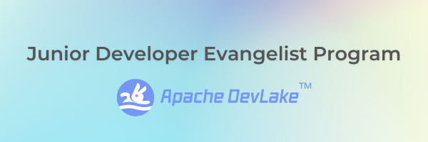

# JDE Program

# Table of Content
1. [Rules](#rules)
2. [Introduction](#introduction)
3. [Core Goals](#core-goals)
4. [Key Deliverables](#key-deliverables)
5. [Curriculum](#curriculum)
6. [Benefits](#benefits)
7. [Note](#note)

## Rules

* **How to Contribute as a JDE? Fork, Create an issue, and followed by a pull request** (Read [CONTRIBUTING.md](CONTRIBUTING.md))
* Individual JDE should be adding their weekly updates [here](Team/README.md) (`Team/README.md`)
* This GitHub repository is the primary source of information and guidelines of the program.
* All the contributions are validated via GitHub only. 
* Check out Weekly tasks [here](Tasks.md) (`Tasks.md`)
* Important announcements will be made in Slack and Emails
* Use [DevLake press kit](https://drive.google.com/drive/folders/10PcKXiWkAg4uqlbv6uSXBeeO41L8O9eU?usp=sharing) for producing banner images, announcement posts, and social media outreach.
* Strictly use the [Style Guide](Content/GUIDELINES.md) for writing content it is given by Apache. 

For any queries or concerns, reach out to us on `maxim@merico.dev` and `joshua.poddoku@merico.dev`
## Introduction
The DevLake Junior Developer Evangelist program is a more advanced and focused type of internship program, dedicated to growing and evolving our open-source presence and community for [Apache DevLake (incubating)](https://devlake.apache.org/). 

The program will last three (3) months for the first rotation, and will require a once per week 45 minute team huddle (TBD time/day based on time-zones and cohort availabilities), and approximately eight (8) hours per week of effort/work/deliverables.

Upon successful completion of the program, the participants will be provided a certificate and letter of completion, as well as a recommendation letter. Furthermore, successful candidates might be invited to continue on in their role in a part-time, full-time, or consulting capacity upon mutual agreement. 

For DevLake, this program will support the continued growth and development of the project and community by expanding content, visibility, and documentation. 

## Core Goals

- Grow DevLake Adoption/Implementation in Open-Source Projects (Seed/Pilot Users) 
- Advance DevLake Use-Cases (Discovery & Community Development) 
- Expand DevLake Community (Stars, Forks, Contributors, & General Members) 
- Enhance DevLake Usability (Documentation, Demos, & Tutorials)

## Key Deliverables
The program participants will commit to a three (3) month rotation where they will accomplish the following five key deliverables: [Final requirements/deliverables TBD]

### Content
Creating content (blog posts, videos, meetups, tutorials, documentation, conference talks) supporting and evangelizing DevLake. 
- Produce 3x blogs in support of DevLake. Few content types that can be explored:
  - Types of content [here](Content/README.md)
- Recruit 3x guest blogs/interviews in support of DevLake.
- Produce 2x documentation pieces. 
- Produce 1x instructional / demo video. 

#### **Submit the content [here](Content/README.md)**

Check `Content/README.md` for more information
### Community
Growing, nurturing, and supporting our growing base of adoptions, contributors, and awareness.
- Recruit 1x guest-blogger (OSS Leaders, Maintainers, Community leaders.)
- Connect 2x open-source projects to DevLake team.
- Present (casual presentation/discussion) at 1x weekly community huddle (topic/focus TBD with Maxim)

### Product
- Building and improving the developer experience, understanding different users (students, early developers, DevOps, Engineering leaders, CTOs, etc.) and translating those to dashboards, case studies, and more.
- Create a 2x Hackathon Dashboard for participants and organizers. (Team activity)

Check [Dashboard/README.md](Dashboard/README.md) for more information

### Outreach
- Participate / Post in 1x thread/forum/discussion per week (on pre-approved forum/platform) 
Events
Includes hosting, participating and collaborating in events, podcasts, regular engagement to activate the community.
- Attend 2x community events. 
- Host 1x community event/meetup/zoom/huddle/AMA etc.

Check [Outreach/README.md](Outreach/README.md) for more information

**The positive result of all these specific goals will be more brand awareness, more adoption, and more growth for DevLake on other measures (Stars, Clones, Forks, etc.)**

## Curriculum

The goal of the program is to provide the participants with robust experience in community management, outreach, content creation, and open source evangelism. Go to [Curriculum.md](Curriculum.md) for more information.

## Benefits

* At the beginning of the program, the participants will receive DevLake apparel and stickers (to share with their friends and with developers they get in contact with.) 

* The Junior Developer Evangelists will connect on a weekly huddle call for forty-five (45) minutes with Maxim to connect and sync up, and will engage on a daily basis (weekdays only) on the DevLake Slack in the main channel, and on a private channel dedicated to the program. 

* At the conclusion of the program, the participants can declare themselves a Junior Developer Evangelist at Merico with a letter of endorsement and a recommendation. 

* **Program participants will receive a total stipend/bonus  of $750(*) over the course of three months and will be  paid via GitHub sponsorship. Participants will also be given $100 USD of networking money each month designated for taking open-source contacts out for meals, drinks, coffees, etc.**

**NOTE: $200 USD for the first month, followed by $250 and $300 for subsequent months.* 

## Note
The JDE (Junior Developer Evangelist) Program is subject to evolve, change and modify. Feel free to share your feedback in this discussion thread.